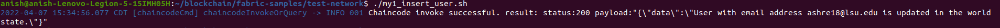
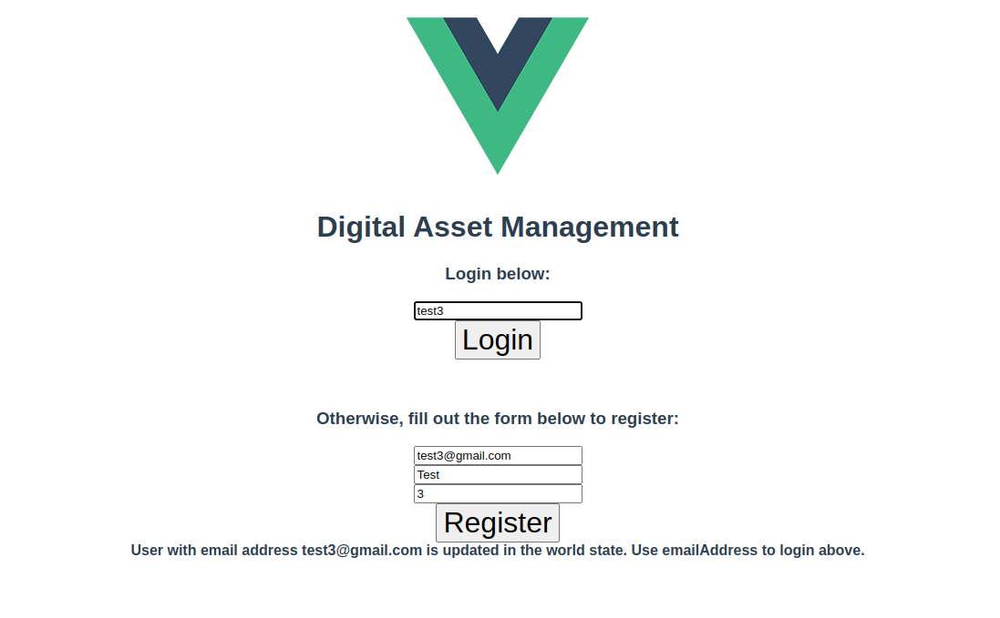

# Hyperledger Fabric Blockchain Project for Spring CSC 4762

##  Hyperledger Fabric Blockchain for managing digital asset


In this code pattern, we will be building a digital asset management application by creating and deploying a smart contract on a Hyperledger Fabric Network running in your local machine.. We will then interact with this application via a user interface created using VueJS.

Digital Asset Management Systems ensure that operations are only performed on a digital asset by individuals (or organizations) that have the right access rights and permissions for the asset. The digital asset is defined as the content (an image, a music file, a document, a video file, etc.) and its metadata. 

The metadata could be as simple as the name of the asset, the name of the owner of the asset and the date of creation of the asset, or it could be something more complex, such as extracted speech from a video (subtitles). In any Digital Asset Management system, there can be any number of users and these users can have the ability to perform various actions on the asset in the system based on the permissions they have. Examples of such actions that are being covered in this developer pattern are: 

1. User registration and user login.
2. Viewing all existing assets in the system.
3. Viewing assets owned by the user that is currently logged in.
4. Uploading metadata of a file as a new asset.
5. Deleting an existing asset.
6. Suggesting edits to an existing asset.
7. Viewing suggested edits for an asset that is owned by the user that is currently logged in.
8. Approving or denying suggeested edits for an asset that is owned by the user that is currently logged in.
9. Allowing other users the permission to update an asset owned by the user that is currently logged in.
10. Assigning another user as the owner of an asset that is owned by the user that is currently logged in.

The large number of users (participants) in this use case, as well as the different kinds of actions (transactions) that can be executed indicate that this is a good use case for Blockchain. Blockchain will also allow for the history of the transactions to be maintained in the ledger, thereby ensuring that there is always a chain of record for any changes that have been made to any asset.

We will create a Hyperledger Fabric Network using their official test network where we will install and instantiate the smart contract. Finally, the VueJS web application, which makes use of the Hyperledger Fabric SDK, can be used to interact with the network.

When you have completed this code pattern, you will understand how to:


* Set up a Hyperledger Fabric network on your local machine.
* Understand Hyperledger Blockchain Smart Contracts(also known as Chaincode, and is written using Javascript).
* Run the Smart Contract in your test network.
* Interact with the Smart Contract and execute its functions in your network.
* Connect web clients to your network. 


## Featured technologies

*   [Hyperledger Fabric v2.2](https://hyperledger-fabric.readthedocs.io/en/release-2.2/) is a platform for distributed ledger solutions, underpinned by a modular architecture that delivers high degrees of confidentiality, resiliency, flexibility, and scalability.
*   [Node.js](https://nodejs.org/en/) is an open source, cross-platform JavaScript run-time environment that executes server-side JavaScript code.
*   [Vue.js 2.6.10](https://vuejs.org) is an open-source JavaScript framework for building user interfaces and single-page applications.


## Prerequisites

* [Docker](https://www.docker.com/)
* [Docker compose](https://docs.docker.com/compose/install/)
* [Node v10.x and npm v6.x or greater](https://nodejs.org/en/download/)
* [VSCode version 1.38.0 or greater](https://code.visualstudio.com)


# Watch the video - Introduction and Demo

**Note: Click on the image below to view the video on YouTube. For Google Chrome, press the Ctrl key + the left mouse button and say `Open link`.**

[](https://youtu.be/tfnRfDFWHUc)


# Course Project

Follow these steps to complete exercises that make up the project. The exercises are described in detail below:

## Steps and exercises:

1. [Downloading and running your first fabric network](#1-clone-the-repo)
2. [Build your network](#2-package-the-smart-contract)
3. [Deploy Smart Contract on our Network](#3-create-the-mailtrap-server)
4. [ Interact with our Smart Contract](#4-build-a-network)
5. [Use a Website to interact with the network](#5-deploy-blockchain-for-maintaining-digital-assets-smart-contract-on-the-network)


## 1. Downloading and running your first fabric network

Use the following command in the terminal to download the official Fabric-Test Network repository

```
curl -sSL https://bit.ly/2ysbOFE | bash -s -- 2.2.2 1.4.9
```


Go into the Fabric directory 

```
cd fabric-samples/
ls
```


Here you will see following sub directories. Among them, we will have test-network directory

Go inside test-network directory

```
cd test-network
ls
```


Here, you may not have all the files as shown in the screenshot. But here you will have network.sh which is the script to run the Hyperledger fabric’s test network project that allows us to create a Hyperledger Blockchain network with 2 peers and an orderer service.

```
./network.sh -h 
```

This brings up all the commands we have at our disposal while using network.sh 


For our 1st exercise, we would just need to run the default test network using the following command:

```
./network.sh up
```

You will have 2 peers and an orderer service running as docker containers.


To bring up what docker containers you have running. You can also use this command:

```
docker ps -a
```


As you can see, since Blockchain in itself is basically a network of nodes with some database that acts as a common ledger, here in this test network, we have 2 organizations that have their own peer network, so 2 peers and a orderer service. Orderer service is unique to Hyperledger networks in that they transmit transactions from client applications to peers.

Later we will send transactions to the network to update the peer's ledger. In Hyperledger, peers use levelDB or CoucheDB to mainytain their ledger database.

**For exercise 1, please have the test network running and upload a screenshot for docker containers.**


# 2. Build your network

In this exercise, we would set up the Blockchain network that we will be using for this project 

From inside the test-network directory, first scrap down the previous network with

```
./network.sh down
docker ps -a
```


Now, lets create the Blockchain network for this project in our local machine:

```
./network.sh up createChannel -ca -s couchdb 
```

As mentioned in the help section of ./network.sh we added few flags

, -ca flag and -s couchdb flag to create the network with 3 additional modifications:
1. -s couchdb: We use couchdb as our ledger database.
2. createChannel: createChannel creates a channel between peers and joins each peer to the channel
3. -ca: to also add 2 Certificate authorities into the network. (You do not need to know the inner workings of Certificate authorities but this is an entity that we need to add additional peers) 

You will get a success message once the command fully executes.


Lets check what we have now using 

```
docker ps -a
```


**For exercise 2, please upload 2 screenshots of the success message and your docker containers as shown above**

# 3. Deploy Smart Contract on our Network

To first get the chaincode code for this project, go to https://github.com/anish01stha/blockchain-and-cryptography and clone the repository.

```
git clone https://github.com/anish01stha/blockchain-and-cryptography
```


As you can see, there are 2 folders in the github repository, one being our Smart Contract (SmartContracts are called ChainCode in Hyperledger, so these terms will be used interchangeably). Please look into the folder to get a general knowledge of the ChainCode. This is written in Javascript because Hyperledger supports 3 languages to write our SmartContracts: Java, Go, and Javascript. Later, your last project assignment will be to modify this chaincode.

The 2nd folder is the web-app which is nothing but a website to interact with the network. This is a User Interface and is not part of anything to do with our Blockchain network except to make it easier to interact with it. Our focus will be in the SmartContract folder and deploying the Website will be bonus points.

To deploy our chain code in the Hyperledger network that we created in Exercise 2, use the following command from inside the test-network folder:

```
./network.sh deployCC -ccn basic -ccp ../../bda/contract/ -ccl javascript
```

After successful deployment, we would get this following message:


# 4. Interact with our Smart Contract


Now that we have all of the required pieces of our Hyperledger Blockchain Network, we can interact with the network with scripts.


In scripts folder of this repository, you have 2 script files:
insert_user.sh
list_all.sh

Look into the contents of insert_user.sh.

Running insert_user.sh from inside the test-network directory will give us following result.

```
./insert_user.sh
```



**In this exercise, you are required to modify the insert_user.sh script file to insert an asset instead.**

Do this by creating a new script file insert_an_asset.sh and copying the contents of insert_user.sh

Refer to line 12 and compare it to the function in the contract repository.

Understand how we executed a function createUser() of the Smart Contract in our Hyperledger network using this script.

Modify this script to insert a digital asset to invoke createDigitalAsset() function from the SmartContract

Use ./list_all.sh script to list all the assets in our Blockchain’s ledger.
You should see something like this if your script is successful.


**For this exercise, please submit your insert_an_asset.sh file and the list_all.sh screenshot after you insert an asset data into the Blockchain.**


# 5. Use a Website to interact with the network

Currently, we are using scripts to interact with the network. However, in real time applications it is very inconvenient for organizations and users to interact with their Blockchain network using scripts.

Hence, we have our website that communicates with our Hyperledger Blockchain network.

To deploy the network, first go to  “fabric-samples/test-network/organizations/peerOrganizations/” in your local machine.

Here you will see 2 folders:


These are configuration files Hyperledger created for the peers that we have running in the network. Inside org1.example.com, you will see the following file structure:


We need the contents of the connection-org1.json file. This is because our web client will be connecting as this peer to the network.


Now for the webclient part,


Inside the github repository, you will see 2 folders:

client and server


Go to blockchain-and-cryptography/web-app/server/config/

Inside the config folder, you will see connection-org1.json

Replace the contents of this connection-org1.json with contents from  fabric-samples/test-network/organizations/peerOrganizations/org1.example.com/connection-org1.json
#### In a new terminal, navigate to the [`server`](web-app/server) directory:

  ```bash
  cd web-app/server/
  ```


#### Build the node dependencies:

  ```bash
  npm install
  ```
  
  
#### Enroll the admin and add identity to the wallet:
  
  **Note: This creates public and private key files for the app-admin in the _idwallet folder inside the [config folder](web-app/server/config). If a folder named "app-admin" exists in the "_idwallet" folder, then the following command will not enroll the app-admin as it already exists in the wallet. Remove the app-admin folder and then run the following command.**
  
  ```bash
  node enrollAdmin.js
  ```


#### Start the server:

  ```bash
  npm start
  ```


#### In a separate terminal, navigate to the [`client`](web-app/client) directory:

  ```bash
  cd web-app/client/
  ```
  
  
#### Build the node dependencies:

  ```bash
  npm install
  ```


#### Start the client:

  ```bash
  npm run serve
  ```

Once both the server and client have successfully started, the UI can be accessed at [http://localhost:8080/?#/](http://localhost:8080/?#/).


Register using any email address(does not need to be a valid one)



Login with the email you created.

Once logged in, your homepage should look like this:


Upload an asset(can be any file: image, document, pdf) in the Blockchain network, your homepage should look like this:


```
For the completion of this exercise and the project please send a screenshot of your page after you upload any asset.
```

The website makes it very easy to interact with the functions of the Smart Contract with a User Interface. Look into other functionalities from the website to explore other functions that were in the Smart Contract.


# Extending the code pattern
This application can be extended by:
* Adding additional metadata for the digital assets.
* Adding enhanced features for registering and logging in users.


# Links
* [Hyperledger Fabric Docs](http://hyperledger-fabric.readthedocs.io/en/latest/)


# License
This code pattern is licensed under the Apache Software License, Version 2. Separate third-party code objects invoked within this code pattern are licensed by their respective providers pursuant to their own separate licenses. Contributions are subject to the [Developer Certificate of Origin, Version 1.1 (DCO)](https://developercertificate.org/) and the [Apache Software License, Version 2](https://www.apache.org/licenses/LICENSE-2.0.txt).

[Apache Software License (ASL) FAQ](https://www.apache.org/foundation/license-faq.html#WhatDoesItMEAN) 